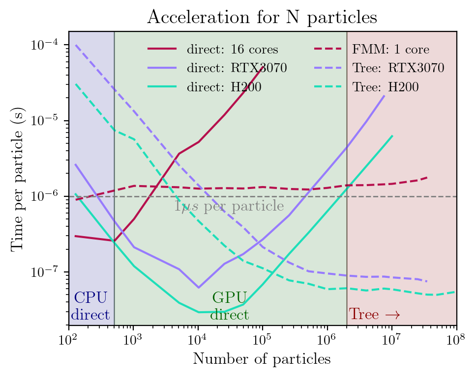

# nbody_streams

Direct N-body simulator and utilities for collisionless systems (single particle type).
Designed for research and prototyping with a minimal API and optional GPU acceleration.

- Direct N-body code with both CPU and optional GPU implementations.
- GPU backend uses custom CUDA kernels (CuPy) and Kahan-style corrections for improved float32 accuracy.
- CPU fallback uses NumPy/Numba where available.
- Optional tree/FMM backend (pyfalcon) and optional external potentials via Agama.
- Intended for collisionless systems with up to ~100k particles (benchmarks depend on hardware).
- Fast stream-generation methods (particle spray, restricted N-body) via AGAMA.

---

## Quick start

```bash
pip install -r requirements.txt
pip install -e .          # editable (development) install

# Optional extras (agama and pyfalcon require --no-build-isolation)
pip install -e ".[agama]"  --no-build-isolation   # AGAMA for fast_sims & external potentials
pip install -e ".[falcon]" --no-build-isolation   # pyfalcon tree/FMM backend
pip install -e ".[healpy]"                        # HEALPix for mollweide projections
pip install -e ".[all]"    --no-build-isolation   # all of the above

# GPU support — install CuPy matching your CUDA version
pip install cupy-cuda11x   # CUDA 11.x
pip install cupy-cuda12x   # CUDA 12.x
```

---

## Package overview

| Subpackage | Description |
|---|---|
| `nbody_streams.fields` | Direct-force kernels (GPU and CPU) |
| `nbody_streams.run` | Leapfrog (KDK) integrator with optional external potentials |
| `nbody_streams.io` | `ParticleReader` for HDF5 snapshots, save/load helpers |
| `nbody_streams.utils` | Profile fitting (Dehnen, Plummer, double-power-law), iterative shape measurement, energy-based unbinding |
| `nbody_streams.fast_sims` | Fast stream generation: particle spray and restricted N-body (requires AGAMA) |
| `nbody_streams.coords` | Coordinate transforms, vector field transforms, stream coordinate generation |
| `nbody_streams.viz` | Mollweide projections, surface density, stream sky plots, stream evolution |
| `nbody_streams.cuda_kernels` | CUDA kernel templates used by CuPy |

---

## API

### Direct N-body (`fields`, `run`)

```python
from nbody_streams import (
    compute_nbody_forces_gpu,
    compute_nbody_forces_cpu,
    compute_nbody_potential_gpu,
    run_nbody_gpu,
    run_nbody_cpu,
    make_plummer_sphere,
)

# Compute accelerations (GPU, float32 with Kahan correction)
acc = compute_nbody_forces_gpu(
    pos, mass, softening=0.01,
    precision='float32_kahan', kernel='spline',
)

# Compute potential energy per particle
phi = compute_nbody_potential_gpu(
    pos, mass, softening=0.01,
    precision='float32_kahan', kernel='spline',
)

# Full N-body integration (GPU)
run_nbody_gpu(
    phase_space,             # (N, 6) array [x, y, z, vx, vy, vz]
    masses,
    time_start=0.0,
    time_end=1.0,
    dt=0.001,
    softening=0.01,
    precision='float32_kahan',
    kernel='spline',
    external_potential=pot,   # optional agama.Potential
    snapshots=10,
    output_dir='./output',
)
```

### Snapshots (`io`)

```python
from nbody_streams import ParticleReader

r = ParticleReader("path/to/sim.*.h5", verbose=True)
snap = r.read_snapshot(10)  # returns dict with pos, vel, mass, time
```

### Fast stream generation (`fast_sims`)

All methods require [AGAMA](https://github.com/GalacticDynamics-Oxford/Agama) (`pip install agama`).

#### Particle spray

```python
import agama
agama.setUnits(mass=1, length=1, velocity=1)

from nbody_streams.fast_sims import create_particle_spray_stream

pot = agama.Potential(str(path_to_potential_ini))

result = create_particle_spray_stream(
    pot_host=pot,
    initmass=20_000,                    # Msun
    sat_cen_present=[-10.9, -3.4, -22.2, 70.4, 188.6, 95.8],  # [kpc, km/s]
    scaleradius=0.01,                   # kpc
    num_particles=10_000,
    time_total=3.0,                     # Gyr lookback
    time_end=13.78,                     # Gyr present epoch
    save_rate=5,                        # number of output snapshots
    prog_pot_kind='Plummer',            # or 'King', 'Plummer_withRcut'
)
# result['times']   — (5,) save times
# result['prog_xv'] — (5, 6) progenitor trajectory
# result['part_xv'] — (N, 5, 6) stream particles at each snapshot
```

**Custom stripping times** (e.g. pericenter-weighted / episodic release):

```python
N = num_particles // 2 + 1
t_strip = my_pericenter_times(N)  # length N, within [time_end - time_total, time_end]

result = create_particle_spray_stream(
    ...,
    time_stripping=t_strip,  # duplicates are handled automatically
)
```

**Fardal+2015 IC method:**

```python
from nbody_streams.fast_sims import (
    create_particle_spray_stream,
    create_ic_particle_spray_fardal2015,
)

result = create_particle_spray_stream(
    ...,
    create_ic_method=create_ic_particle_spray_fardal2015,
)
```

**Adding a subhalo perturber:**

```python
result = create_particle_spray_stream(
    ...,
    add_perturber={
        'mass': 1e8,              # Msun
        'scaleRadius': 0.5,       # kpc (NFW)
        'w_subhalo_impact': [x, y, z, vx, vy, vz],  # impact phase-space
        'time_impact': 1.5,       # Gyr ago
    },
)
```

#### Restricted N-body

```python
from nbody_streams.fast_sims import run_restricted_nbody

result = run_restricted_nbody(
    pot_host=pot,
    initmass=20_000,
    sat_cen_present=[-10.9, -3.4, -22.2, 70.4, 188.6, 95.8],
    scaleradius=0.01,
    num_particles=10_000,
    time_total=3.0,
    time_end=13.78,
    step_size=50,           # ODE steps per potential update
    save_rate=5,
    trajsize_each_step=5,
    prog_pot_kind='Plummer',
    dynFric=True,           # optional dynamical friction
)
# result['times']      — save times
# result['prog_xv']    — progenitor trajectory
# result['part_xv']    — particle phase-space
# result['bound_mass'] — bound mass at each save time
```

**Pre-existing particles** (skip rewinding/sampling):

```python
result = run_restricted_nbody(
    pot_host=pot,
    initmass=20_000,
    sat_cen_present=com_xv,
    xv_init=my_particles,   # shape (N, 6)
    time_total=0.5,
    time_end=13.78,
    step_size=50,
    save_rate=3,
    trajsize_each_step=5,
)
```

### Analysis utilities (`utils`)

```python
from nbody_streams.utils import (
    empirical_density_profile,
    empirical_circular_velocity_profile,
    empirical_velocity_dispersion_profile,
    empirical_velocity_rms_profile,
    empirical_velocity_anisotropy_profile,
    fit_dehnen_profile,
    fit_plummer_profile,
    fit_double_spheroid_profile,
    fit_iterative_ellipsoid,
    find_center_position,
    iterative_unbinding,
)

# Radial profiles
r_bins, rho = empirical_density_profile(positions, masses, bins=50)
r_bins, v_circ = empirical_circular_velocity_profile(positions, masses)
r_bins, sigma = empirical_velocity_dispersion_profile(positions, velocities)

# Profile fitting
gamma, a, M, r_fit, rho_fit = fit_dehnen_profile(positions, masses)
a, M, r_fit, rho_fit = fit_plummer_profile(positions, masses)

# Iterative shape measurement
axes, axis_ratios, eigvecs = fit_iterative_ellipsoid(positions, masses)

# Centre finding
cen = find_center_position(positions, masses)

# Energy-based iterative unbinding
bound_mask = iterative_unbinding(
    positions, velocities, masses,
    center_position=cen,
)
```

> **Note:** `compute_iterative_boundness` is deprecated — use `iterative_unbinding` instead.

### Coordinates (`coords`)

```python
from nbody_streams.coords import (
    convert_coords,
    convert_vectors,
    convert_to_vel_los,
    generate_stream_coords,
    get_observed_stream_coords,
)

# Coordinate transforms: 'cart' <-> 'sph' <-> 'cyl'
sph = convert_coords(pos, 'cart', 'sph')                   # (N, 3) -> (r, theta, phi)
cyl = convert_coords(pos, 'cart', 'cyl')                   # (N, 3) -> (R, phi, z)

# Vector field transforms (position + velocity together)
pos_sph, vel_sph = convert_vectors(pos, vel, 'cart', 'sph')

# Line-of-sight velocity
v_los = convert_to_vel_los(xv)                              # from galactocentric phase-space

# Stream coordinates (phi1, phi2) from galactocentric phase-space
phi1, phi2 = generate_stream_coords(xv_stream, xv_prog=xv_prog)

# Full observables: stream coords + distance, PM, v_los
phi1, phi2, dist, pm, v_los = get_observed_stream_coords(
    xv_stream, xv_prog=xv_prog,
)
```

### Visualization (`viz`)

```python
from nbody_streams.viz import (
    plot_density,
    plot_mollweide,
    plot_stream_sky,
    plot_stream_evolution,
)

# Projected density map
plot_density(part=snap)

# Mollweide sky projection (requires healpy for smoothing)
plot_mollweide(pos, weights=masses, initial_nside=60)

# Stream in sky coordinates (alpha/delta and phi1/phi2)
plot_stream_sky(xv_stream, xv_prog=xv_prog)

# Stream evolution over time (from fast_sims output)
plot_stream_evolution(result['prog_xv'], times=result['times'], part_xv=result['part_xv'])
```

---

## Performance

GPU benchmarks (N = 10,240 particles, RTX 3080, `--use_fast_math` + arch-tuned):

| Kernel | Time/Step | Throughput | Energy Conservation |
|--------|-----------|------------|---------------------|
| Float32 + float4 | **1.5 ms** | ~100 Gint/s | < 0.001% |
| Float32_kahan + float4 | 1.7 ms | ~100 Gint/s | < 0.001% |
| Float64 | ~20 ms | ~4.5 Gint/s | < 0.001% |

Approaching the theoretical FLOP ceiling (~25 FLOPs per interaction).

### Which solver should I use?

The plot below compares time-per-particle for direct (CPU & GPU) and FMM/tree solvers across particle counts.

<p align="center">
  
</p>

**Recommendations:**

| Particle count | Recommended method | Why |
|---|---|---|
| N < 500 | **CPU direct** (Numba) | Lowest latency — no GPU kernel-launch overhead. |
| 1K – 100K | **GPU direct** (consumer GPU) | ~10x faster than CPU direct; exact O(N²) forces with float32 Kahan precision. |
| 100K – 500K | **GPU direct** (consumer GPU) ≈ FMM/tree | A consumer GPU (e.g. RTX 3070) matches falcON/FMM throughput up to ~500K particles. |
| 500K – 2M | **GPU direct** (datacenter GPU) ≈ FMM/tree | An H200-class GPU keeps direct-force time competitive with tree codes up to ~2M particles. |
| N > 2M | **Tree / FMM** (falcON) | O(N) FMM scaling wins; direct O(N²) becomes prohibitive on any current GPU. |

---

<details>
<summary><strong>Float32 precision analysis (Newton's 3rd Law at small scales)</strong></summary>

### Summary

Float32 kernels are mathematically correct but suffer from precision loss when particle positions are at small scales (< 0.1 length units). This manifests as violation of Newton's 3rd Law at the ~1% level for scales around 0.01.

**Important:** Even without scaling, the "asymmetric" float32 forces **do not cause energy drift** over long integrations because:
1. Integration is performed in float64 (positions, velocities)
2. Force errors are small and largely random (not systematic)
3. Symplectic integrators are robust to small force errors

### Scale-dependent error

| Scale Factor | Typical \|r\| | Float32 Net Force | Status |
|---|---|---|---|
| 0.1 | 10 | 6.4e-9 | Excellent |
| 1 | 1.0 | 1.4e-6 | Good |
| 10 | 0.1 | 1.2e-4 | Marginal |
| 100 | 0.01 | 1.0e-2 | Broken |

### Solutions

**Option 1 — Unit scaling (recommended):** Rescale positions to O(1) before computing forces. Gives perfect Newton's 3rd Law + full float32 speed.

```python
scale = prog_scaleradius  # e.g. 0.01 kpc
pos_scaled = pos / scale
acc_scaled = compute_nbody_forces_gpu(pos_scaled.astype(np.float32), ...)
acc_physical = acc_scaled / (scale**2)
```

**Option 2 — Float32 as-is:** Simplest code, energy still conserved to < 0.001%. Newton's 3rd Law violated by ~1% (cosmetic only).

**Option 3 — Float64:** Accurate at all scales, ~10x slower. Best for small N (< 5000).

### Comparison: direct N-body vs tree methods

| Method | Force Accuracy | Energy Conservation | Speed |
|---|---|---|---|
| Direct N^2 (float32) | ~1% asymmetry | < 0.001% drift | 1.5 ms/step |
| Tree (float32, theta=0.5) | 1-5% force errors | ~0.01-0.1% drift | 5 ms/step |
| Tree (float64, theta=0.5) | 1-5% force errors | ~0.001% drift | 10 ms/step |

Direct N-body with float32 gives **better energy conservation** than tree methods because tree approximation errors are systematic (monopole bias), while float32 rounding errors are random and cancel statistically.

</details>

---

## License

MIT
