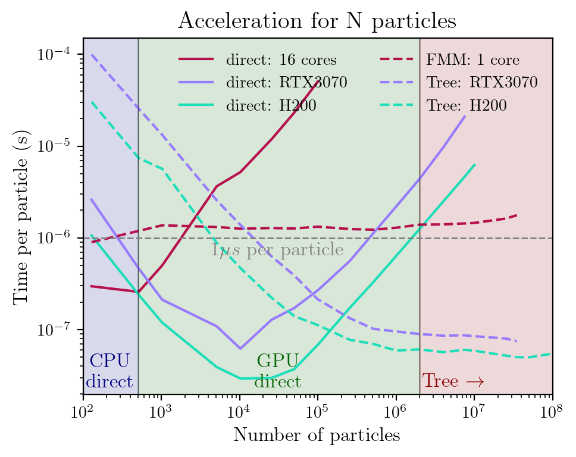

# nbody_streams

Direct N-body simulator and utilities for collisionless multi-species systems.
Designed around a minimal, Pythonic API — while keeping every computationally
expensive routine in compiled, parallelized code with no pure-Python loops in
the hot path.

- **Multi-species** simulations with any number of particle types (dark matter, stars, gas tracers, black holes, …).
- Single entry point: `run_simulation` with `architecture='cpu'|'gpu'` and `method='direct'|'tree'` flags.
- **GPU direct**: hand-written CUDA kernels compiled at runtime via CuPy + nvcc — `float4` 128-bit vectorized loads, optional Kahan compensated summation, `--use_fast_math`, and architecture-tuned PTX.
- **GPU tree**: Barnes-Hut GPU tree code (C++ / CUDA shared library) — O(N log N) scaling, per-particle softening, watchdog-guarded KDK integrator.
- **CPU direct**: Numba JIT-compiled, auto-parallelized force kernels (`@njit(parallel=True)`) using all available CPU cores.
- **CPU tree / FMM**: falcON fast multipole method via pyfalcon — true O(N) scaling for large particle counts.
- Optional external potentials via Agama (evaluated in C++ per timestep, added to N-body accelerations).
- Intended for collisionless systems with up to ~2M particles (benchmarks depend on hardware).
- Fast stream-generation methods (particle spray, restricted N-body) via AGAMA.

---

## Quick start

```bash
pip install -r requirements.txt
pip install -e .          # editable (development) install

# Optional extras (agama and pyfalcon require --no-build-isolation)
pip install -e ".[agama]"  --no-build-isolation   # AGAMA for fast_sims & external potentials
pip install -e ".[falcon]" --no-build-isolation   # pyfalcon tree/FMM backend
pip install -e ".[healpy]"                        # HEALPix for mollweide projections
pip install -e ".[all]"    --no-build-isolation   # all of the above

# GPU support — install CuPy matching your CUDA version
pip install cupy-cuda12x   # CUDA 12.x
pip install cupy-cuda13x   # CUDA 13.x

# GPU tree code — build the shared library (requires nvcc in PATH)
cd nbody_streams/tree_gpu
make -j$(nproc)            # produces libtreeGPU.so alongside the source files
cd ../..
```

---

## Package overview

| Subpackage | Description |
|---|---|
| `nbody_streams.species` | `Species` dataclass, `PerformanceWarning`, and array-building helpers |
| `nbody_streams.sim` | `run_simulation` — unified multi-species entry point (all backends) |
| `nbody_streams.fields` | Force and potential kernels: dispatches to GPU (CUDA) or CPU (Numba) backends |
| `nbody_streams.cuda_kernels` | Hand-written CUDA kernel source strings (float32 `float4`, float64); compiled at runtime via nvcc |
| `nbody_streams.run` | KDK leapfrog integrators (`run_nbody_gpu`, `run_nbody_cpu`); `make_plummer_sphere` IC generator |
| `nbody_streams.tree_gpu` | GPU Barnes-Hut tree code: `tree_gravity_gpu`, `TreeGPU`, `run_nbody_gpu_tree`, watchdog; requires `make` |
| `nbody_streams.io` | `ParticleReader` for HDF5 snapshots, save/load helpers |
| `nbody_streams.utils` | Profile fitting (Dehnen, Plummer, double-power-law), iterative shape measurement, energy-based unbinding |
| `nbody_streams.fast_sims` | Fast stream generation: particle spray and restricted N-body (requires AGAMA) |
| `nbody_streams.agama_helper` | Fit, store, modify, and load Agama Multipole/CylSpline BFE potentials; HDF5 coefficient archives; time-evolving potentials; FIRE helpers |
| `nbody_streams.coords` | Coordinate transforms, vector field transforms, stream coordinate generation |
| `nbody_streams.viz` | SPH/histogram surface density (`plot_density`), Mollweide projections, stream sky and evolution plots; `render_surface_density`, `get_smoothing_lengths` |

---

## Under the hood

The Python layer handles only orchestration: argument validation, backend dispatch,
HDF5 I/O, and snapshot management.  Every force evaluation is delegated to
compiled, parallelized code:

| Path | Implementation | Key details |
|---|---|---|
| **GPU direct** | CUDA kernels compiled at runtime (CuPy + nvcc) | `float4` 128-bit vectorized loads; optional Kahan compensated summation; `--use_fast_math`; arch-tuned PTX via `compute_capability` auto-detection |
| **GPU tree** | C++/CUDA shared library (`libtreeGPU.so`); ctypes interface | Barnes-Hut with monopole + quadrupole; per-particle softening (max convention); watchdog-guarded KDK; float32 throughout |
| **CPU direct** | Numba `@njit(parallel=True)` | Prange-parallelized inner loop; JIT-compiled on first call, cached thereafter |
| **CPU tree / FMM** | falcON via pyfalcon (C++) | True O(N) fast multipole method; independent of the direct-force code path |
| **Integration** | KDK symplectic leapfrog | GPU direct: float64 pos/vel; GPU tree: float32 throughout; only force calls use float32/float64 kernels |
| **External potentials** | Agama C++ library | `agama.Potential.__call__` invoked once per timestep; result added directly to N-body accelerations |

---

## API

### Multi-species simulation (`run_simulation`, `Species`)

The recommended entry point for all N-body runs.  It handles single- and
multi-species setups, dispatches to the correct backend, and returns
per-species final phase-space arrays.

#### `Species` dataclass

```python
from nbody_streams import Species

# Named constructors for common types
dm    = Species.dark(N=10_000, mass=1e6, softening=0.1)   # dark matter
stars = Species.star(N=2_000,  mass=5e4, softening=0.03)  # stellar particles

# Arbitrary species (e.g. a single central black hole)
bh = Species(name='bh', N=1, mass=1e9, softening=0.001)

# Per-particle mass / softening are also accepted
import numpy as np
m_arr = np.linspace(1e5, 2e5, 500)
gas   = Species(name='gas', N=500, mass=m_arr, softening=0.05)
```

`Species` parameters:

| Field | Type | Description |
|---|---|---|
| `name` | `str` | Unique species identifier |
| `N` | `int` | Number of particles |
| `mass` | `float` or `ndarray (N,)` | Particle mass(es) |
| `softening` | `float` or `ndarray (N,)` | Gravitational softening length(s) |

---

#### `run_simulation`

```python
from nbody_streams import run_simulation, Species, make_plummer_sphere
import numpy as np

result = run_simulation(
    phase_space,          # (N_total, 6) — all species concatenated
    species,              # list[Species] in the same order as phase_space
    time_start=0.0,
    time_end=1.0,
    dt=0.001,
    architecture='gpu',   # 'cpu' or 'gpu'
    method='direct',      # 'direct' (O(N^2)) or 'tree' (GPU: Barnes-Hut; CPU: falcON O(N))
    external_potential=pot,        # optional agama.Potential
    output_dir='./output',
    save_snapshots=True,
    snapshots=100,
    verbose=True,
    debug_energy=False,   # True -> print Q=KE/|PE| and dE/E at each output interval
    # Backend-specific kwargs (passed through **kwargs):
    #   theta=0.6                  tree opening angle           (tree backends)
    #   nthreads=None              CPU thread count             (CPU direct)
    #   precision='float32_kahan'  force computation precision  (GPU direct)
    #   external_update_interval=1 ext. force caching interval  (GPU backends)
    #   nleaf=64, ncrit=64         tree node size params        (GPU tree only)
)
# result is dict[str, ndarray]  keyed by species name
# result['dark'].shape  -> (N_dark,  6)
# result['star'].shape  -> (N_star,  6)
```

**Example — single species: Globular Cluster**

```python
from nbody_streams import run_simulation, Species, make_plummer_sphere

# ~10 000 equal-mass stars in a Plummer model
# M_total = 5e5 Msun, scale radius a = 5 pc = 0.005 kpc
N = 10_000
xv, _ = make_plummer_sphere(N, M_total=5e5, a=0.005)

gc = Species.star(N=N, mass=5e5 / N, softening=0.0005)  # 0.5 pc softening

result = run_simulation(
    xv, [gc],
    time_start=0.0,
    time_end=0.1,          # 0.1 kpc/(km/s) ~ 100 Myr
    dt=1e-4,
    architecture='gpu',    # or 'cpu' for quick tests
    method='direct',
    output_dir='./output/gc',
    snapshots=50,
)
# result['star'] -> (10000, 6) final phase-space
```

**Example — multi-species: Dwarf Galaxy (dark matter + stars + gas tracers)**

```python
from nbody_streams import run_simulation, Species, make_plummer_sphere
import numpy as np

# --- Dark matter halo: 5 000 particles, extended (a = 1 kpc) ---
N_dm = 5_000
M_dm = 1e9          # Msun
xv_dm, _ = make_plummer_sphere(N_dm, M_total=M_dm, a=1.0)
dm = Species.dark(N=N_dm, mass=M_dm / N_dm, softening=0.1)  # 100 pc softening

# --- Stellar disc: 1 000 particles, more concentrated (a = 0.3 kpc) ---
N_star = 1_000
M_star = 5e7        # Msun
xv_star, _ = make_plummer_sphere(N_star, M_total=M_star, a=0.3)
star = Species.star(N=N_star, mass=M_star / N_star, softening=0.03)

# --- Gas tracers: 500 collisionless test particles (a = 0.5 kpc) ---
N_gas = 500
M_gas = 2e7         # Msun
xv_gas, _ = make_plummer_sphere(N_gas, M_total=M_gas, a=0.5)
gas = Species(name='gas', N=N_gas, mass=M_gas / N_gas, softening=0.05)

# --- Combine all particles ---
xv_all = np.vstack([xv_dm, xv_star, xv_gas])

result = run_simulation(
    xv_all,
    [dm, star, gas],
    time_start=0.0,
    time_end=1.0,          # 1 kpc/(km/s) ~ 1 Gyr
    dt=1e-3,
    architecture='gpu',
    method='direct',
    output_dir='./output/dwarf',
    snapshots=100,
)

# Per-species final coordinates
dm_final   = result['dark']   # (5000, 6)
star_final = result['star']   # (1000, 6)
gas_final  = result['gas']    # (500,  6)
```

Reading snapshots from a multi-species run:

```python
from nbody_streams import ParticleReader

r    = ParticleReader('./output/dwarf/snapshot.h5')
snap = r.read_snapshot(50)

# New primary API: per-species dict
snap.species['dark']['posvel']   # (5000, 6)
snap.species['star']['posvel']   # (1000, 6)
snap.species['gas']['posvel']    # (500,  6)

# Backward-compat aliases still work
snap.dark['posvel']
snap.star['posvel']
```

---

### Initial conditions (`make_plummer_sphere`)

```python
from nbody_streams import make_plummer_sphere

xv, mass = make_plummer_sphere(
    N         = 10_000,       # number of particles
    M_total   = 1e5,          # total mass [Msun]
    a         = 0.01,         # Plummer scale radius [kpc]
    G         = 4.300917e-6,  # gravitational constant (kpc, km/s, Msun units)
    seed      = 42,
)
# xv   : (N, 6) float64  — [x, y, z, vx, vy, vz]
# mass : (N,)  float64  — equal-mass particles summing to M_total
```

Positions and velocities are sampled from the exact Plummer distribution using
rejection sampling (Aarseth 1974).  The centre of mass and bulk velocity are
corrected to zero before returning.

---

### GPU tree-code (`tree_gpu`)

The GPU tree backend must be compiled once before use:

```bash
cd nbody_streams/tree_gpu
make -j$(nproc)    # auto-detects GPU architecture via nvidia-smi / CuPy
```

After building, it is available as a subpackage:

```python
from nbody_streams.tree_gpu import tree_gravity_gpu, TreeGPU, run_nbody_gpu_tree
import cupy as cp

# One-shot: compute forces + potential for N particles
pos  = cp.asarray(xv[:, :3], dtype=cp.float32)
mass = cp.asarray(masses,    dtype=cp.float32)
eps  = cp.asarray(softening, dtype=cp.float32)   # per-particle or scalar

acc, phi = tree_gravity_gpu(pos, mass, eps, G=4.3009e-6, theta=0.6)

# Pre-allocated handle for time-stepping loops (saves ~27 ms of GPU malloc per step)
with TreeGPU(N, eps=0.05, theta=0.6) as tree:
    for step in range(n_steps):
        acc, phi = tree_gravity_gpu(pos, mass, eps, tree=tree)
        vel += 0.5 * dt * acc
        pos += dt * vel
        acc, phi = tree_gravity_gpu(pos, mass, eps, tree=tree)
        vel += 0.5 * dt * acc

# Full integration — same interface as run_simulation with method='tree'
final_xv = run_nbody_gpu_tree(
    phase_space, masses, time_start=0.0, time_end=5.0, dt=1e-4,
    softening=eps_arr, theta=0.6, step_timeout_s=60.0,
    output_dir="./output", snapshots=500,
)

# Or via the unified entry point:
result = run_simulation(
    phase_space, species,
    time_start=0.0, time_end=5.0, dt=1e-4,
    architecture='gpu', method='tree', theta=0.6,
)
```

The `_StepWatchdog` inside `run_nbody_gpu_tree` fires a `KeyboardInterrupt` in
the main thread if any single integration step exceeds `step_timeout_s` seconds,
protecting against deadlocked CUDA kernels.

---

### Low-level API — Direct N-body (`fields`, `run`)

`run_simulation` covers the common case.  For full control — custom softening
kernels, alternative float precision, per-particle softening, or
`external_update_interval` on the CPU — call the backend functions directly:

```python
from nbody_streams import (
    compute_nbody_forces_gpu,
    compute_nbody_forces_cpu,
    compute_nbody_potential_gpu,
    run_nbody_gpu,
    run_nbody_cpu,
    make_plummer_sphere,
)

# Compute accelerations (GPU, float32 with Kahan correction)
acc = compute_nbody_forces_gpu(
    pos, mass, softening=0.01,
    precision='float32_kahan', kernel='spline',
)

# Compute potential energy per particle
phi = compute_nbody_potential_gpu(
    pos, mass, softening=0.01,
    precision='float32_kahan', kernel='spline',
)

# Full N-body integration (GPU direct) — full kernel / precision control
run_nbody_gpu(
    phase_space,             # (N, 6) array [x, y, z, vx, vy, vz]
    masses,
    time_start=0.0,
    time_end=1.0,
    dt=0.001,
    softening=0.01,
    precision='float64',     # 'float32' | 'float64' | 'float32_kahan'
    kernel='dehnen_k2',      # 'newtonian' | 'plummer' | 'dehnen_k1' | 'dehnen_k2' | 'spline'
    external_potential=pot,
    external_update_interval=5,  # cache ext. forces for 5 steps
    force_extra=None,            # optional: callable(pos, vel, masses, t) -> (N,3)
                                 # e.g. a Chandrasekhar DF closure — user handles GPU/CPU
    debug_energy=True,       # print Q and dE/E at each output interval
    snapshots=10,
    output_dir='./output',
)

# Full N-body integration (CPU) — tree with custom kernel / theta
run_nbody_cpu(
    phase_space, masses,
    time_start=0.0, time_end=1.0, dt=0.001,
    softening=0.02,
    method='tree',
    kernel='dehnen_k2',      # or integer 2; pyfalcon: 0=plummer 1=dehnen_k1 2=dehnen_k2
    theta=0.5,
    nthreads=32,
    debug_energy=True,       # phi returned for free by falcON; zero overhead
    output_dir='./output',
)
```

### Snapshots (`io`)

```python
from nbody_streams import ParticleReader

r = ParticleReader("path/to/sim.*.h5", verbose=True)
snap = r.read_snapshot(10)  # returns dict with pos, vel, mass, time
```

### Fast stream generation (`fast_sims`)

All methods require [AGAMA](https://github.com/GalacticDynamics-Oxford/Agama) (`pip install agama`).

#### Particle spray

```python
import agama
agama.setUnits(mass=1, length=1, velocity=1)

from nbody_streams.fast_sims import create_particle_spray_stream

pot = agama.Potential(str(path_to_potential_ini))

result = create_particle_spray_stream(
    pot_host=pot,
    initmass=20_000,                    # Msun
    sat_cen_present=[-10.9, -3.4, -22.2, 70.4, 188.6, 95.8],  # [kpc, km/s]
    scaleradius=0.01,                   # kpc
    num_particles=10_000,
    time_total=3.0,                     # Gyr lookback
    time_end=13.78,                     # Gyr present epoch
    save_rate=5,                        # number of output snapshots
    prog_pot_kind='Plummer',            # or 'King', 'Plummer_withRcut'
)
# result['times']   — (5,) save times
# result['prog_xv'] — (5, 6) progenitor trajectory
# result['part_xv'] — (N, 5, 6) stream particles at each snapshot
```

**Custom stripping times** (e.g. pericenter-weighted / episodic release):

```python
N = num_particles // 2 + 1
t_strip = my_pericenter_times(N)  # length N, within [time_end - time_total, time_end]

result = create_particle_spray_stream(
    ...,
    time_stripping=t_strip,  # duplicates are handled automatically
)
```

**Fardal+2015 IC method:**

```python
from nbody_streams.fast_sims import (
    create_particle_spray_stream,
    create_ic_particle_spray_fardal2015,
)

result = create_particle_spray_stream(
    ...,
    create_ic_method=create_ic_particle_spray_fardal2015,
)
```

**Adding a subhalo perturber:**

```python
result = create_particle_spray_stream(
    ...,
    add_perturber={
        'mass': 1e8,              # Msun
        'scaleRadius': 0.5,       # kpc (NFW)
        'w_subhalo_impact': [x, y, z, vx, vy, vz],  # impact phase-space
        'time_impact': 1.5,       # Gyr ago
    },
)
```

#### Restricted N-body

```python
from nbody_streams.fast_sims import run_restricted_nbody

result = run_restricted_nbody(
    pot_host=pot,
    initmass=20_000,
    sat_cen_present=[-10.9, -3.4, -22.2, 70.4, 188.6, 95.8],
    scaleradius=0.01,
    num_particles=10_000,
    time_total=3.0,
    time_end=13.78,
    step_size=50,           # ODE steps per potential update
    save_rate=5,
    trajsize_each_step=5,
    prog_pot_kind='Plummer',
    dynFric=True,           # optional dynamical friction
)
# result['times']      — save times
# result['prog_xv']    — progenitor trajectory
# result['part_xv']    — particle phase-space
# result['bound_mass'] — bound mass at each save time
```

**Pre-existing particles** (skip rewinding/sampling):

```python
result = run_restricted_nbody(
    pot_host=pot,
    initmass=20_000,
    sat_cen_present=com_xv,
    xv_init=my_particles,   # shape (N, 6)
    time_total=0.5,
    time_end=13.78,
    step_size=50,
    save_rate=3,
    trajsize_each_step=5,
)
```

### AGAMA potential helper (`agama_helper`)

> Requires [AGAMA](https://github.com/GalacticDynamics-Oxford/Agama).
> See [`docs/agama_helper.md`](docs/agama_helper.md) for the full reference.

```python
from nbody_streams import agama_helper as ah

# --- Read coefficient dataclasses (file, HDF5, or raw string — same call) ---
mc = ah.read_coefs("potential/090.dark.none_8.coef_mult")    # Multipole
cc = ah.read_coefs("MW_cylsp.h5", group_name="snap_090")     # CylSpline from HDF5

# Inspect
print(mc.lmax, mc.l_values)        # e.g.  8  [0, 2, 4, 6, 8]
print(mc.total_power(2))           # quadrupole power

# Filter harmonics (int = all m for that l; tuple = specific (l,m))
mc_axi = mc.zeroed([0, 2, 4])             # keep l=0,2,4; all m
mc_sel = mc.zeroed([(0,0), (2,0)])        # keep specific (l,m) pairs

# --- Load Agama potential (from any source) ---
pot = ah.load_agama_potential("potential/090.dark.none_8.coef_mult")
pot = ah.load_agama_potential("MW_mult.h5", group_name="snap_090")
pot = ah.load_agama_potential(mc_axi)                  # directly from dataclass
pot = ah.load_agama_potential("MW_mult.h5",
                               group_name="snap_090",
                               keep_lm_mult=[0, 2])    # in-memory filtering

# --- Time-evolving potential ---
# From HDF5 (times embedded at write time)
pot_ev = ah.load_agama_evolving_potential("MW_mult.h5")

# From a native Agama .ini file
pot_ev = ah.load_agama_evolving_potential("potential/MW_mult.ini")

# With per-snapshot filtering
pot_ev = ah.load_agama_evolving_potential("MW_mult.h5", keep_lm_mult=[0, 2])

# --- Pack text coefficient files into HDF5 ---
import numpy as np
ah.write_snapshot_coefs_to_h5(
    snapshot_ids=range(90, 101),
    coef_file_patterns=["potential/{snap:03d}.dark.none_8.coef_mult"],
    h5_output_paths=["MW_mult.h5"],
    times=np.linspace(6.0, 14.0, 11),    # embed times for load_agama_evolving_potential
)
```

---

### Analysis utilities (`utils`)

```python
from nbody_streams.utils import (
    empirical_density_profile,
    empirical_circular_velocity_profile,
    empirical_velocity_dispersion_profile,
    empirical_velocity_rms_profile,
    empirical_velocity_anisotropy_profile,
    fit_dehnen_profile,
    fit_plummer_profile,
    fit_double_spheroid_profile,
    fit_iterative_ellipsoid,
    find_center,
    iterative_unbinding,
)

# Radial profiles
r_bins, rho = empirical_density_profile(pos, mass, bins=50)
r_bins, v_circ = empirical_circular_velocity_profile(pos, mass)
r_bins, sigma = empirical_velocity_dispersion_profile(pos, vel)

# Profile fitting
gamma, a, M, r_fit, rho_fit = fit_dehnen_profile(pos, mass)
a, M, r_fit, rho_fit = fit_plummer_profile(pos, mass)

# Iterative shape measurement
axes, axis_ratios, eigvecs = fit_iterative_ellipsoid(pos, mass)

# Centre finding (default method="density_peak" via gravitational potential minimum)
cen = find_center(pos, mass)

# Centre finding with velocity centering
cen_pos, cen_vel = find_center(pos, mass, vel=vel, return_velocity=True, vel_aperture=5.0)

# Energy-based iterative unbinding
bound_mask = iterative_unbinding(
    pos, vel, mass,
    center_position=cen,
)
```

> **Note:** `find_center_position` is a deprecated alias for `find_center`.
> `compute_iterative_boundness` is also deprecated -- use `iterative_unbinding` instead.

### Coordinates (`coords`)

```python
from nbody_streams.coords import (
    convert_coords,
    convert_vectors,
    convert_to_vel_los,
    generate_stream_coords,
    get_observed_stream_coords,
)

# Coordinate transforms: 'cart' <-> 'sph' <-> 'cyl'
sph = convert_coords(pos, 'cart', 'sph')                   # (N, 3) -> (r, theta, phi)
cyl = convert_coords(pos, 'cart', 'cyl')                   # (N, 3) -> (R, phi, z)

# Vector field transforms (position + velocity together)
pos_sph, vel_sph = convert_vectors(pos, vel, 'cart', 'sph')

# Line-of-sight velocity
v_los = convert_to_vel_los(xv)                              # from galactocentric phase-space

# Stream coordinates (phi1, phi2) from galactocentric phase-space
phi1, phi2 = generate_stream_coords(xv_stream, xv_prog=xv_prog)

# Full observables: stream coords + distance, PM, v_los
phi1, phi2, dist, pm, v_los = get_observed_stream_coords(
    xv_stream, xv_prog=xv_prog,
)
```

### Visualization (`viz`)

```python
from nbody_streams.viz import (
    plot_density,
    plot_mollweide,
    plot_stream_sky,
    plot_stream_evolution,
    render_surface_density,   # low-level SPH renderer
    get_smoothing_lengths,    # per-particle SPH smoothing lengths
)

# --- Projected density map ---

# From raw arrays — SPH (default, GPU-accelerated when CuPy is available)
plot_density(pos=pos, mass=mass, gridsize=100.0)

# From a ParticleReader snapshot — extract dark matter automatically
snap = reader.read_snapshot(50)
plot_density(snap=snap, spec='dark', gridsize=100.0, vmin=4.0, vmax=9.0)

# Choose rendering method
plot_density(pos=pos, mass=mass, method='sph')          # SPH kernel (default)
plot_density(pos=pos, mass=mass, method='gauss_smooth', smooth_sigma=1.5)
plot_density(pos=pos, mass=mass, method='histogram')

# Return the raw (pre-log10) density array for further analysis
im, dens = plot_density(pos=pos, mass=mass, return_dens=True)

# Slice along Z and render X-Y surface density
plot_density(pos=pos, mass=mass, xval='x', yval='y',
             slice_width=2.0, density_kind='surface')

# --- Low-level SPH API ---

# Full SPH surface-density grid (GPU -> CPU fallback)
grid, bounds = render_surface_density(x, y, mass, resolution=512, gridsize=120.0)

# Smoothing lengths only (useful for custom renderers)
h = get_smoothing_lengths(np.column_stack([x, y]), k_neighbors=32)

# --- Other viz ---

# Mollweide sky projection (requires healpy)
plot_mollweide(pos, weights=masses, initial_nside=60)

# Stream in sky coordinates (alpha/delta and phi1/phi2)
plot_stream_sky(xv_stream, xv_prog=xv_prog)

# Stream evolution over time (from run_simulation output)
plot_stream_evolution(result['prog_xv'], times=result['times'], part_xv=result['part_xv'])
```

#### `plot_density` method options

| `method`       | Description                                          | Best for                              |
|----------------|------------------------------------------------------|---------------------------------------|
| `'sph'`        | SPH cubic-spline kernel splatting (GPU-accelerated)  | Physics-accurate density maps (default) |
| `'gauss_smooth'` | 2-D histogram + Gaussian filter                   | Quick smooth previews                 |
| `'histogram'`  | Raw 2-D histogram / pixel area                       | Counting statistics, debugging        |

---

## Caveats and known limitations

### Dynamical friction with external potentials

When `external_potential` is supplied to any `run_*` function or
`run_simulation`, the host is modelled as a **smooth, fixed background field**.
There is no back-reaction on the host and no granularity-driven scattering.
For low-mass satellites this is an excellent approximation; for LMC-class
objects it is not.

**Chandrasekhar DF is now implemented** via the `dynamical_friction=True` flag
in `run_simulation`.

```python
import agama
agama.setUnits(mass=1, length=1, velocity=1)
pot = agama.Potential(type='NFW', mass=1e12, scaleRadius=15.0,
                      outerCutoffRadius=300.0)

result = run_simulation(
    xv, [dm],
    time_start=0.0, time_end=5.0, dt=1e-3,
    architecture='gpu', method='direct',
    external_potential=pot,
    dynamical_friction=True,
    df_M_sat=5e9,
    df_coulomb_mode='variable',
)
```

See [`docs/dynamical_friction.md`](docs/dynamical_friction.md) for the full
reference including all `df_*` kwargs, the Coulomb logarithm modes, and
core-stalling suppression.

**For advanced users** the internal closure is available directly:

```python
from nbody_streams._chandrasekhar import make_df_force_extra

df_fn = make_df_force_extra(pot, M_sat=5e9, t_start=0.0, t_end=5.0)
final = run_nbody_gpu(xv, masses, ..., force_extra=df_fn)
```

**The `agama_helper` subpackage** is accessible as `nb.agama_helper` (or
`from nbody_streams import agama_helper`).  See
[`docs/agama_helper.md`](docs/agama_helper.md) for the full reference.

**When DF is safe to ignore:**

The Chandrasekhar inspiral timescale at orbital radius r scales as

```
t_df  ~  1.17 * (M_host / M_sat) * (r / V_c) / ln(Lambda)
```

| M_sat (Msun) | Example | t_df at 50 kpc in MW halo | Safe to ignore? |
|---|---|---|---|
| < 1e8 | Globular cluster | > 2000 Gyr | Yes, always |
| 1e8 – 1e9 | Ultra-faint dwarf | 200 – 2000 Gyr | Yes |
| 1e9 – 1e10 | SMC-class | 20 – 200 Gyr | Marginal over few-Gyr runs |
| > 1e10 | LMC-class | < 20 Gyr | No — DF is important |

For stream progenitors with M_tot < ~1e9 Msun, or for simulations shorter
than a few Gyr, neglecting DF introduces negligible orbit evolution error.
`run_simulation` emits a `PerformanceWarning` when the total satellite mass
exceeds `1e10 M_sun` and `external_potential` is set but `dynamical_friction`
is `False`.

---

## Performance

GPU benchmarks (N = 10,240 particles, RTX 3080, `--use_fast_math` + arch-tuned):

| Kernel | Time/Step | Throughput | Energy Conservation |
|--------|-----------|------------|---------------------|
| Float32 + float4 | **1.5 ms** | ~100 Gint/s | < 0.001% |
| Float32_kahan + float4 | 1.7 ms | ~100 Gint/s | < 0.001% |
| Float64 | ~20 ms | ~4.5 Gint/s | < 0.001% |

Approaching the theoretical FLOP ceiling (~25 FLOPs per interaction).

### Which solver should I use?

The plot below compares time-per-particle for direct (CPU & GPU) and FMM/tree solvers across particle counts.

<p align="center">
  
</p>

**Recommendations:**

| Particle count | Recommended method | Why |
|---|---|---|
| N < 500 | **CPU direct** (Numba) | Lowest latency — no GPU kernel-launch overhead. |
| 1K – 100K | **GPU direct** (consumer GPU) | ~10x faster than CPU direct; exact O(N²) forces with float32 Kahan precision. |
| 100K – 500K | **GPU direct** (consumer GPU) ≈ FMM/tree | A consumer GPU (e.g. RTX 3070) matches falcON/FMM throughput up to ~500K particles. |
| 500K – 2M | **GPU direct** (datacenter GPU) ≈ FMM/tree | An H200-class GPU keeps direct-force time competitive with tree codes up to ~2M particles. |
| N > 2M | **Tree / FMM** (falcON) | O(N) FMM scaling wins; direct O(N²) becomes prohibitive on any current GPU. |

---

<details>
<summary><strong>Float32 precision analysis (Newton's 3rd Law at small scales)</strong></summary>

### Summary

Float32 kernels are mathematically correct but suffer from precision loss when particle positions are at small scales (< 0.1 length units). This manifests as violation of Newton's 3rd Law at the ~1% level for scales around 0.01.

**Important:** Even without scaling, the "asymmetric" float32 forces **do not cause energy drift** over long integrations because:
1. Integration is performed in float64 (positions, velocities)
2. Force errors are small and largely random (not systematic)
3. Symplectic integrators are robust to small force errors

### Scale-dependent error

| Scale Factor | Typical \|r\| | Float32 Net Force | Status |
|---|---|---|---|
| 0.1 | 10 | 6.4e-9 | Excellent |
| 1 | 1.0 | 1.4e-6 | Good |
| 10 | 0.1 | 1.2e-4 | Marginal |
| 100 | 0.01 | 1.0e-2 | Broken |

### Solutions

**Option 1 — Unit scaling (recommended):** Rescale positions to O(1) before computing forces. Gives perfect Newton's 3rd Law + full float32 speed.

```python
scale = prog_scaleradius  # e.g. 0.01 kpc
pos_scaled = pos / scale
acc_scaled = compute_nbody_forces_gpu(pos_scaled.astype(np.float32), ...)
acc_physical = acc_scaled / (scale**2)
```

**Option 2 — Float32 as-is:** Simplest code, energy still conserved to < 0.001%. Newton's 3rd Law violated by ~1% (cosmetic only).

**Option 3 — Float64:** Accurate at all scales, ~10x slower. Best for small N (< 5000).

### Comparison: direct N-body vs tree methods

| Method | Force Accuracy | Energy Conservation | Speed |
|---|---|---|---|
| Direct N^2 (float32) | ~1% asymmetry | < 0.001% drift | 1.5 ms/step |
| Tree (float32, theta=0.5) | 1-5% force errors | ~0.01-0.1% drift | 5 ms/step |
| Tree (float64, theta=0.5) | 1-5% force errors | ~0.001% drift | 10 ms/step |

Direct N-body with float32 gives **better energy conservation** than tree methods because tree approximation errors are systematic (monopole bias), while float32 rounding errors are random and cancel statistically.

</details>

---

## License

MIT
